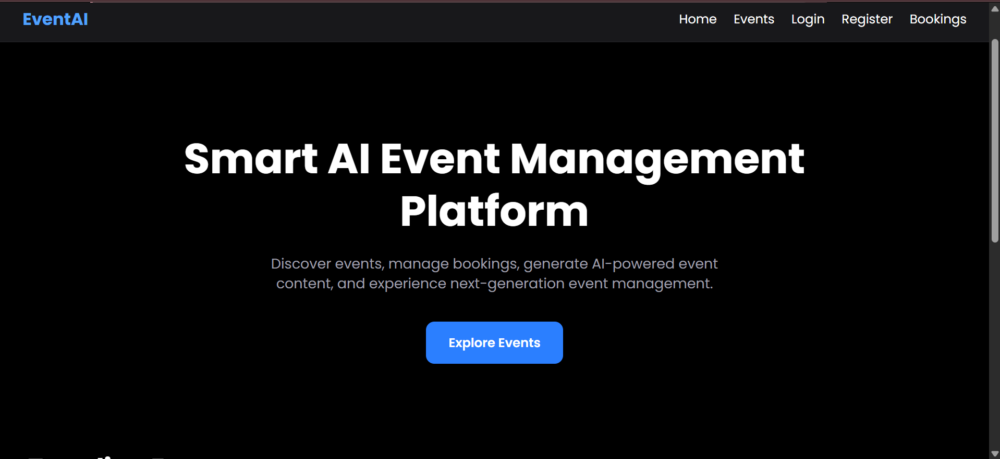
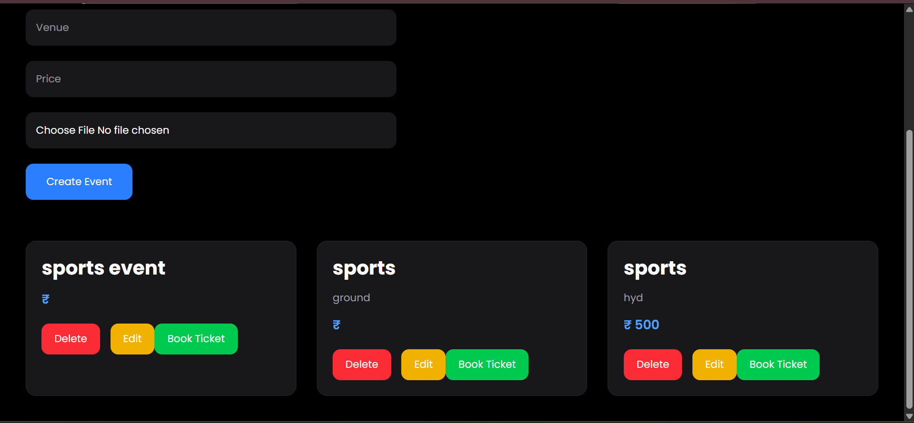
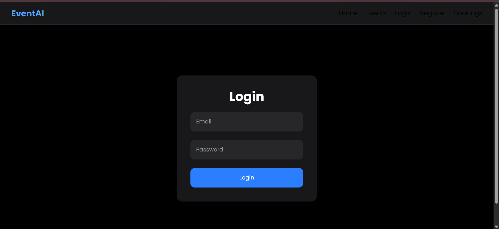
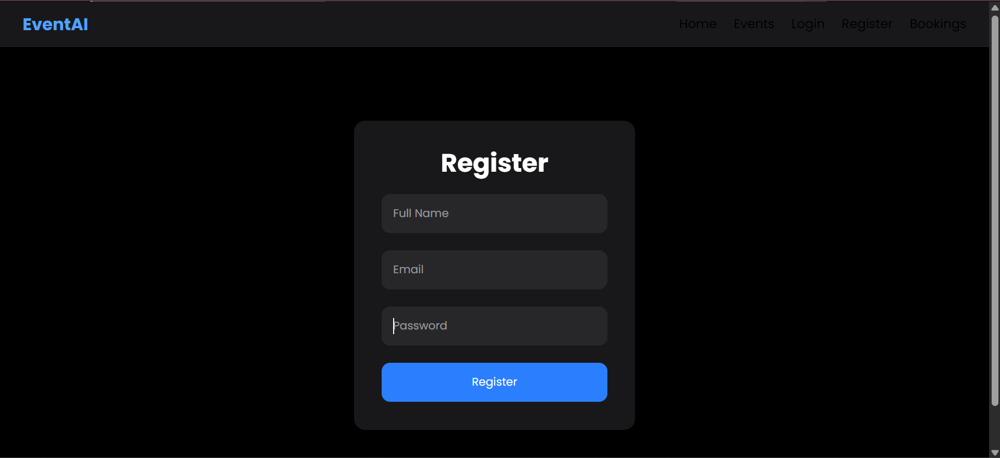
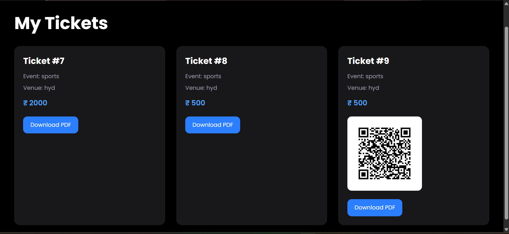
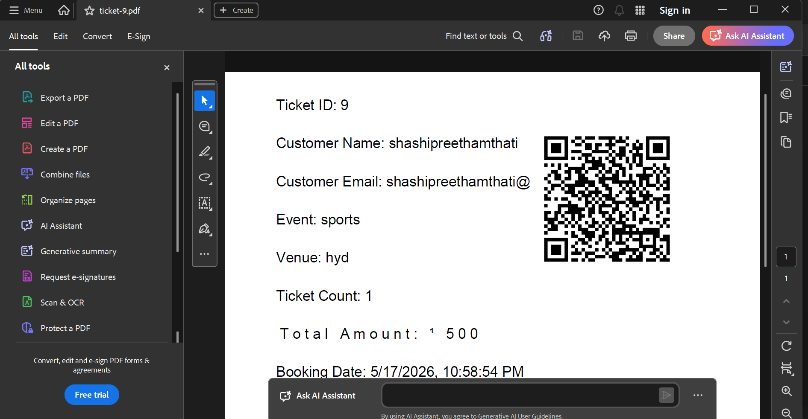

# 🎉 Smart Event Management Platform

A full-stack AI-powered event management platform built using React.js, Tailwind CSS, Supabase, and Vercel.

Users can:

- Browse events
- Book tickets
- Generate QR-based tickets
- Download PDF tickets
- Manage events through organizer dashboards

---

# 🚀 Live Demo

🔗 https://smart-event-platform-pied.vercel.app

---

# ✨ Features

## 👤 Authentication

- User Login/Register
- Role-based access control
- Organizer & Attendee roles

## 🎫 Event Booking

- Browse available events
- Book tickets instantly
- QR code ticket generation
- PDF ticket downloads

## 🧑‍💼 Organizer Dashboard

- Create events
- Manage bookings
- View analytics

## ☁️ Cloud Features

- Supabase Database
- Image Uploads
- Live Deployment on Vercel

---

# 🛠️ Tech Stack

## Frontend

- React.js
- Tailwind CSS
- React Router

## Backend / Database

- Supabase

## Additional Libraries

- qrcode
- jspdf
- react-icons

## Deployment

- Vercel

---

# 📸 Screenshots

## 🏠 Home Page



---

## 🎟️ Events Page


---

## 🎟️ Events Page 2



---

## 🔐 Login Page



---

## 📝 Register Page



---

## 🎫 Tickets Page



---

## 📄 PDF Ticket



# ⚙️ Installation

## Clone Repository

```bash
git clone https://github.com/YOUR_USERNAME/smart-event-platform.git
```

📌 Future Improvements
UPI Payment Integration
Email Ticket Delivery
AI Event Recommendations
Seat Selection System
Advanced Analytics
Mobile Responsive Optimization
👨‍💻 Author

Shashi Preetham

Built using React + Supabase
